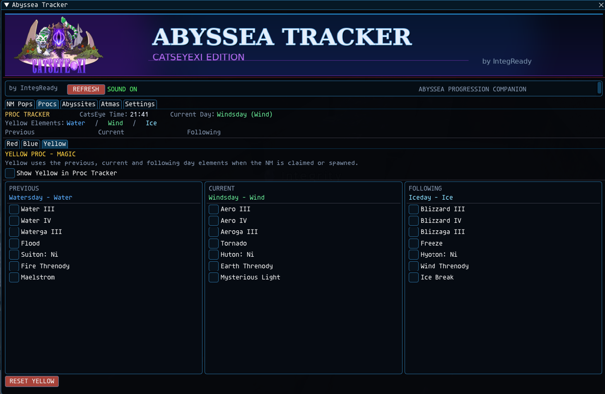
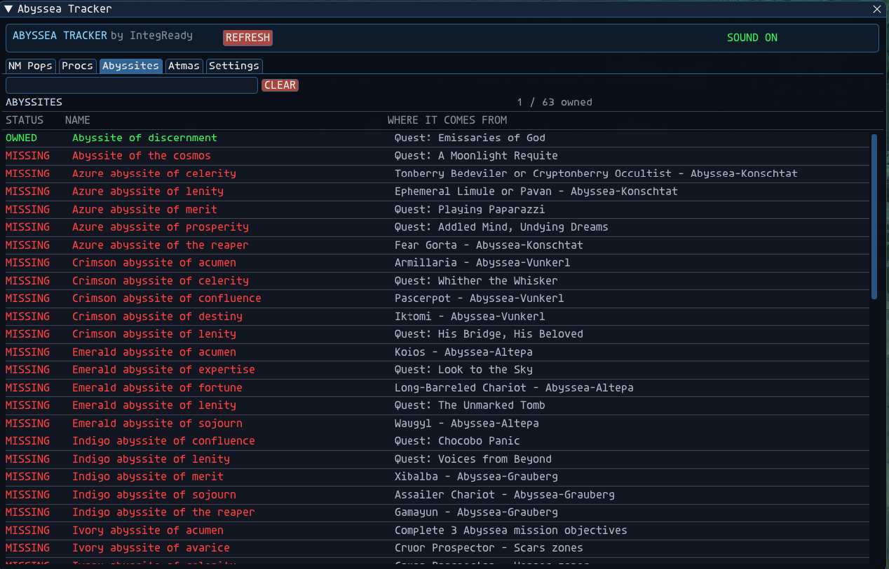
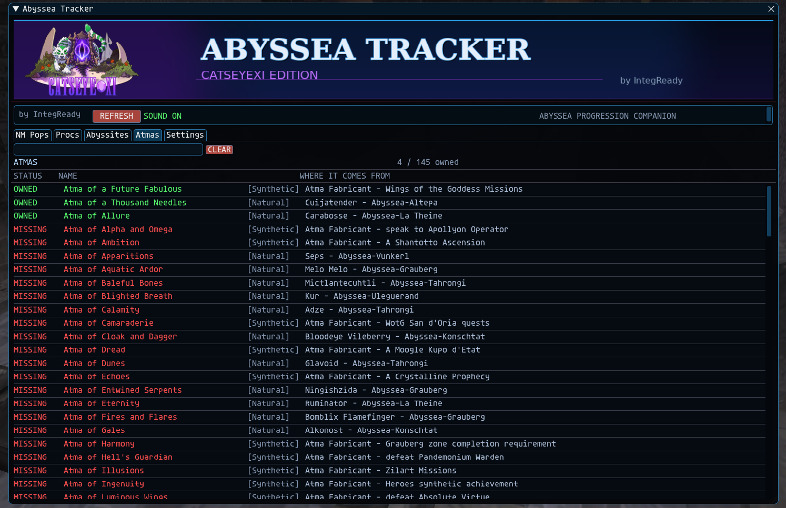

# Abyssea Tracker - CatsEyeXI Edition

An Ashita v4 addon designed specifically for Abyssea on CatsEyeXI.

Abyssea Tracker puts NM progression, pop items, procs, Abyssites, Atmas, lights, and Visitant time into one clean in-game interface.

Created by **IntegReady**

---

## Features

- All 9 Abyssea zones
- NM progression and pop requirements
- Physical pop-item ownership and storage location
- Key Item tracking
- CatsEyeXI-specific NM drop information
- Red, Blue, and Yellow Proc Tracker
- Abyssite collection tracking
- Atma collection tracking
- Visitant time and Abyssea light tracker
- Optional draggable NM and Proc trackers
- Acquisition sound alerts
- Full and Compact UI modes

---

## NM Tracker

View NMs by zone along with their spawn requirements, pop items, Key Items, progression rewards, and CatsEyeXI drops.

---

## Proc Tracker

Built-in Red, Blue, and Yellow proc tracking.

Blue procs automatically use the current **CatsEye Time**, while Yellow procs display the previous, current, and following day's elements.

---

## Abyssites

Search the Abyssite collection and quickly see which ones you own, which you're missing, and where they come from.

---

## Atmas

Track your Atma collection with Owned/Missing status and acquisition sources.

---

## Settings

Control sounds, display options, the Abyssea status bar, and other addon preferences.

---

## Abyssea Status Bar

An optional draggable bar displays your current:

**Visitant Time | Pearlescent | Azure | Ruby | Amber | Gold | Silver | Ebon**

It automatically appears while you're in Abyssea and can be enabled or disabled in Settings.

---

## Installation

Download the latest release and place the `abyssea` folder inside:

    Ashita/addons/

Then load it with:

    /addon load abyssea

The main command is:

    /aby

---

## Server Impact

Abyssea Tracker is designed to be passive and event-driven.

It does not inject outgoing packets, continuously poll the CatsEyeXI server, or make web requests while running.

The addon primarily reacts to information the FFXI client already receives and reads local Ashita client state.

---

## Requirements

- CatsEyeXI
- Ashita v4

---

## Current Version

**v1.5.1**

---

## Credits

Created and maintained by **IntegReady** for the CatsEyeXI community.

FINAL FANTASY XI and Abyssea are properties of Square Enix.

This is an independent community addon and is not affiliated with or endorsed by Square Enix.
