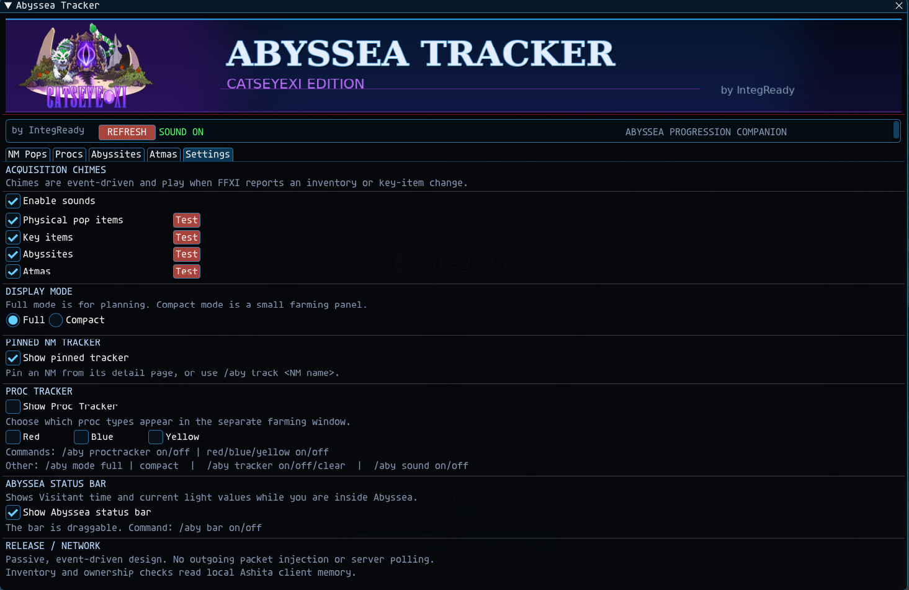

# Abyssea Tracker
### CatsEyeXI Edition

A lightweight Ashita v4 addon for tracking Abyssea progression on CatsEyeXI.

## Features

- NM pop item and key item tracking
- Abyssite tracking
- Atma tracking
- Red, Blue, and Yellow proc reference
- Abyssea Visitant time and light tracking
- CatsEyeXI-specific NM drops
- Optional acquisition sounds
- NM and Proc Tracker overlays

## Screenshots

### NM Tracker

### Procs

### Abyssites

### Atmas

### Settings

## Installation

Place the `abyssea` folder in your Ashita v4 `addons` folder.

Load with:

`/addon load abyssea`
Important to zone after loading to update your current Key items from the cached ones if anything changed while the addon was not loaded. 
Open the tracker with:

`/aby`

## Author

Developed by **IntegReady** for **CatsEyeXI**.
